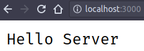

# Node.js Server

## Menggunakan module `http`

Kita bisa membuat server HTTP sederhana dengan module `http`.

Hasilnya nanti kita bisa mencetak halaman web sederhana di hostname dan port `localhost:3000`.

Seperti biasa, buatlah file misalnya `server.js` di directory yang sudah dibuat.

Di sini kita hanya perlu menggunakan library built-in dari Node tanpa harus instal package dari npm.

```js
const http = require("http")

const HOST = "localhost"
const PORT = 3000

const requestHandler = (request, response) => {
  console.log(request.url)
  response.end("Hello Server")
}

const server = http.createServer(requestHandler)

server.listen(PORT, HOST, err => {
  if (err) {
    return console.log("Something bad happened", err)
  }

  console.log(`Server is listening on ${HOST}:${PORT}`)
})
```

Lalu jalankan lagi dengan Node.

```sh
$ node server.js
Server is listening on localhost:3000
```

Server tersebut dapat kita akses di browser dengan langsung atau `curl`.



```
$ curl http://localhost:3000
Hello Server%
```

Untuk lebih lanjut membuat aplikasi web ataupun REST API dengan Node, kita bisa menggunakan library seperti [Express](https://expressjs.com), [Hapi](http://hapijs.com), [Koa](http://koajs.com), [Restify](http://restify.com), atau [Fastify](https://fastify.io).
